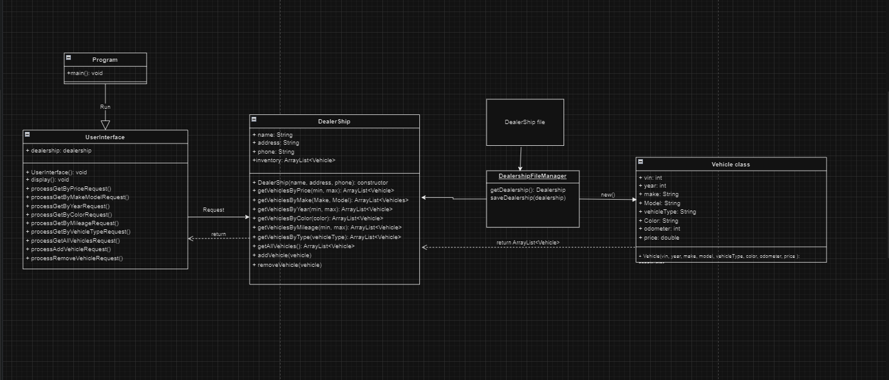

# car-dealer-ship
### Overview of project
I made a car dealer ship project for a car sales man. This project will include a dealer ship and vehicles. The project will allow the user to add, remove, and search for cars in the inventory. 

UML for project:

## Phase 1

I started by working on the Dealership class and my vehicle class. In my Dealer ship class i added get all vehicles functionaly, add or remove vehicles from the inventory. I added test cases for get all vehicles and add a vehicle.